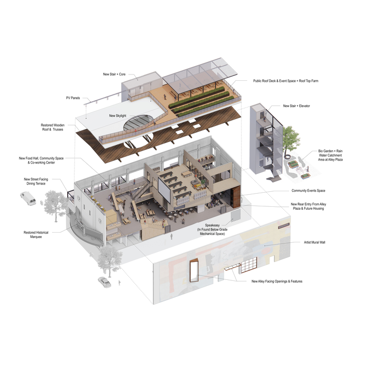

# studiosk.net

Source for studiosk.net. Built with Jekyll and GitHub Pages.

> Studio Skaggs Kennedy is a Berkeley-based design practice for architecture and urbanism, licensed in California and Washington state. Maxine Skaggs Kennedy and Sean Kennedy founded their studio in 2015. The practice is run as a studio in which study, research and collaboration are vitally important to the approach of design. Design is seen as a vigorous interaction with place at all scales and with all disciplines.



## Developing

```
jekyll serve --watch
```

## Image resizing

All image resizing commands use Image Magick. Project page images can all be resized to fit within a 1000x750 bounds. This command does not change the aspect ratio of any images. News section photos use the same size.

```sh
cd /path/to/images
mkdir web
magick mogrify -resize 1000x750 -path ./web *.jpg
```

Featured images (on https://studiosk.net/projects) should be slightly smaller and only be 750x wide.

```sh
magick convert in.jpg -resize 750x featured.jpg
```

* [magick convert](https://imagemagick.org/script/convert.php)
* [magick mogrify](https://imagemagick.org/script/mogrify.php)
